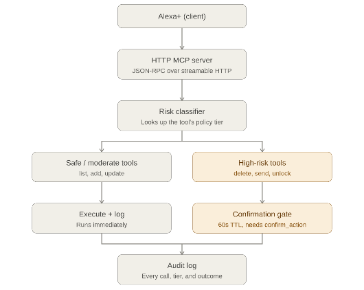

# Guardian MCP
 
A self-hosted MCP server for Alexa+ (Build, Ship, Shape hackathon, Alexa+ track) that adds a permission and audit layer most agentic tool servers don't have.
 
## The idea
 
Most MCP servers expose tools flatly. An LLM can call `delete_x` with the same friction as `list_x`. Guardian MCP tags every tool with a **risk tier** and enforces different behavior per tier:
 
| Tier     | Examples                              | Behavior                                   |
|----------|----------------------------------------|---------------------------------------------|
| SAFE     | `list_reminders`, `get_audit_log`      | Runs immediately                           |
| MODERATE | `add_reminder`, `update_reminder`      | Runs immediately, logged                   |
| HIGH     | `delete_reminder`, `send_message`, `unlock_smart_lock` | **Not** run on first call - returns a `confirmation_id` instead. Only `confirm_action` (within 60s) actually executes it. |
 
Every tool call - executed, pending, confirmed, expired, cancelled, or denied - is written to an append-only audit log, exposed as the
`assistant://audit-log` MCP resource.

## Rough Architecture Diagram


 
## Project structure
 
```
guardian-mcp/
├── policy.py         # risk tiers + which tools are in which tier
├── storage.py         # thread-safe JSON file storage
├── assistant.py        # domain logic + audit log + confirmation gate
├── server.py            # STDIO MCP server (local testing) + tool/resource schemas
├── http_server.py        # Streamable HTTP transport (what Alexa+ connects to)
├── requirements.txt
└── data/                 # created at runtime, gitignored
```